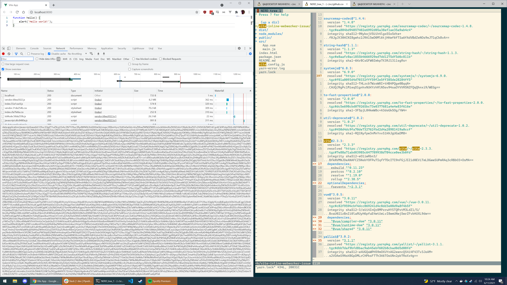
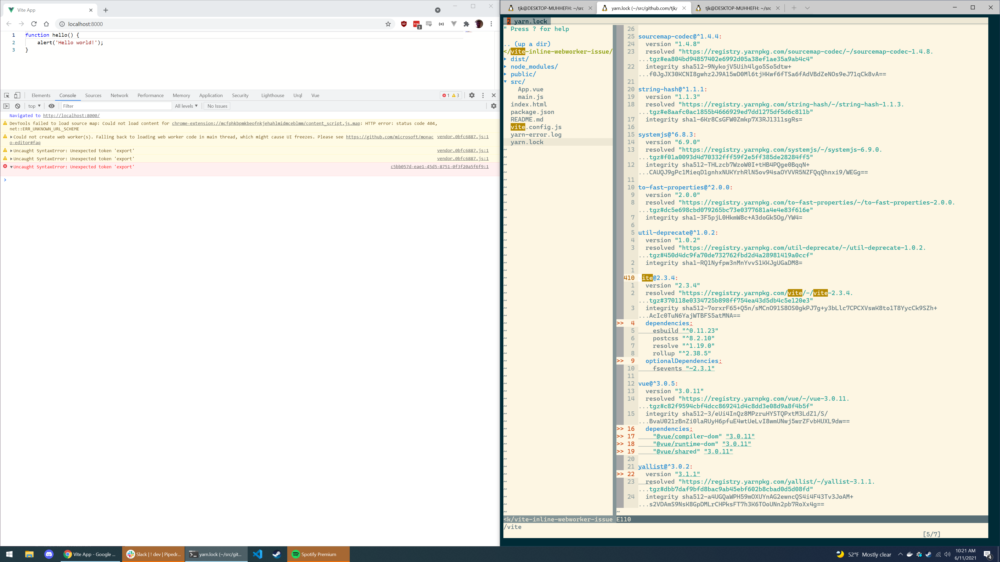

# vite-inline-webworker-issue (https://github.com/vitejs/vite/issues/3768)

```
yarn
yarn build
cd dist && python -m SimpleHTTPServer
open http://localhost:8000
```

## Vite 2.3.3



## Vite 2.3.4


